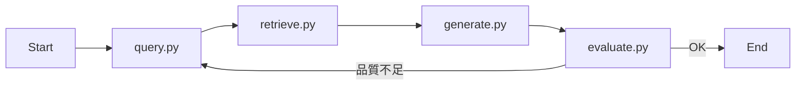

# RAGエージェント ファイル構成案

## 前提・不足依存の補足

- **FAISS**: `requirements.txt` に `faiss-cpu`（または `faiss-gpu`）と `langchain-community` を追加する想定（FAISS の VectorStore は `langchain_community.vectorstores` で利用可能）。
- **エントリ**: 既存の Chainlit をチャット UI として使い、その中で LangGraph のエージェントを実行する構成を想定。

---

## 推奨ディレクトリ・ファイル構成

```
RAGagent/
├── .env
├── .gitignore
├── requirements.txt
├── app.py                    # Chainlit エントリ（UI とエージェントの起動）
├── config.py                 # 設定（モデル名、FAISS パス、ループ上限など）
│
├── src/
│   ├── __init__.py
│   │
│   ├── graph.py              # LangGraph のグラフ定義（ノード・エッジ・条件分岐）
│   ├── nodes/
│   │   ├── __init__.py
│   │   ├── query.py          # 複数クエリ生成（3本）
│   │   ├── retrieve.py       # 複数クエリでの並列ベクトル検索
│   │   ├── generate.py       # 検索結果の統合と回答生成
│   │   └── evaluate.py       # 回答の品質評価（ループ判定用）
│   │
│   ├── retriever/
│   │   ├── __init__.py
│   │   ├── store.py          # FAISS のロード・VectorStore の取得
│   │   └── search.py         # 検索インターフェース（必要なら query.py から呼ぶだけでも可）
│   │
│   └── prompts.py            # クエリ生成・回答生成・評価用のプロンプト文字列
│
├── data/                     # インデックス・元データ（任意）
│   └── .gitkeep
└── scripts/                  # インデックス作成スクリプトなど（任意）
    └── build_index.py
```

---

## 各ファイルの役割


| パス                                               | 役割                                                                                                                                            |
| ------------------------------------------------ | --------------------------------------------------------------------------------------------------------------------------------------------- |
| [app.py](app.py)                                 | Chainlit の `@cl.on_message` でメッセージを受信し、`src.graph` のコンパイル済みグラフを invoke。ストリームや履歴はここで扱う。                                                        |
| [config.py](config.py)                           | `os.getenv` や定数（Gemini モデル名、FAISS インデックスパス、最大ループ数、検索数 k など）を集約。                                                                               |
| [src/graph.py](src/graph.py)                     | LangGraph の `StateGraph` を定義。ノードは `nodes.query` / `retrieve` / `generate` / `evaluate` を参照。`evaluate` から「継続」なら `query` へ、「終了」ならエンドへ、という条件エッジ。 |
| [src/nodes/query.py](src/nodes/query.py)         | ユーザークエリから 3 本のクエリを生成（Gemini + プロンプト）。state には `queries: list[str]` を渡す想定。                                                                     |
| [src/nodes/retrieve.py](src/nodes/retrieve.py)   | `queries` に対して FAISS で並列検索（`asyncio.gather` や LangChain の並列実行）。結果をマージ・重複除去し、state に `documents` をセット。                                         |
| [src/nodes/generate.py](src/nodes/generate.py)   | 統合した `documents` と元のユーザークエリで Gemini により回答を生成。state に `answer` をセット。                                                                           |
| [src/nodes/evaluate.py](src/nodes/evaluate.py)   | 回答の品質を評価（スコア or 良/悪）。閾値に応じて「続行」か「終了」を返し、グラフの条件エッジで使う。                                                                                         |
| [src/retriever/store.py](src/retriever/store.py) | FAISS インデックスのロード（`FAISS.load_local` 等）と LangChain の VectorStore 返却。必要なら Embedding モデルもここで渡す。                                                  |
| [src/prompts.py](src/prompts.py)                 | クエリ展開用・回答生成用・評価用のプロンプトテンプレート（文字列または `ChatPromptTemplate`）。                                                                                    |


---

## グラフの流れ（イメージ）




- **State**: `messages`（入力）、`queries`、`documents`、`answer`、必要なら `evaluation_result` や `loop_count` を 1 つの TypedDict / dataclass で共有。
- **並列検索**: `retrieve.py` 内で 3 クエリそれぞれに `vectorstore.similarity_search(q, k=n)` をかけ、結果を 1 つのリストにマージしてから `generate` に渡す。

---

## インデックス作成（FAISS）について

- 初回は `scripts/build_index.py` などで、ドキュメントを Embedding 化し `FAISS.from_documents`（または `from_texts`）で保存。
- 本番では `store.py` で `FAISS.load_local(config.FAISS_INDEX_PATH, embeddings, allow_dangerous_deserialization=True)` のように読み込む。
- Embedding は Gemini の `langchain_google_genai.GoogleGenerativeAIEmbeddings` で統一すると扱いやすい。

---

## まとめ

- **graph.py** で「複数クエリ生成 → 並列検索 → 統合・回答生成 → 評価 → ループ判定」を 1 本の LangGraph として定義する。
- **nodes/** に処理を分割し、**retriever/** で FAISS の扱いを集約する。
- プロンプトは **prompts.py** にまとめ、**config.py** で環境依存を吸収すると、後からモデルや閾値を変えやすくなる。
- コードはご自身で実装する前提のため、上記はあくまで「どのファイルに何を書くか」の目安として利用できる。

必要であれば、`requirements.txt` に追加する具体的な行（`faiss-cpu`, `langchain-community`）だけ別途リストアップもできる。